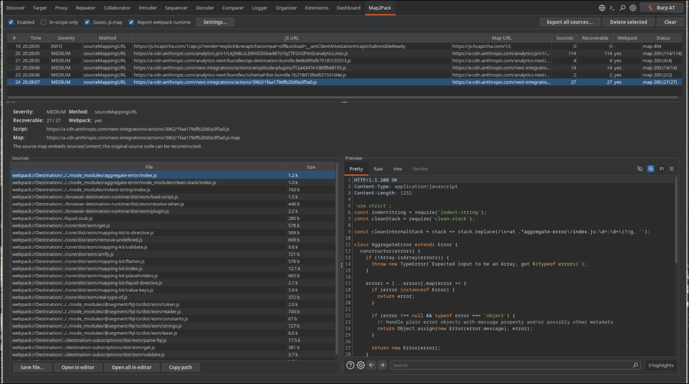

<p align="center">
  
</p>

<p align="center">
  <a href="https://github.com/0xdeadbife/map2pack/actions/workflows/build.yml"></a>
  <a href="LICENSE"></a>
</p>

<p align="center">
  Recover a web app's original source code from <b>source maps</b>, straight inside Burp Suite.
</p>

---

Map2Pack watches JavaScript responses as you browse, finds every way the source is
exposed (external `.map`, inline maps, guessable maps, webpack runtime), lists them
in its own tab, lets you read and export the reconstructed code, and raises each case
as a native Burp finding.

The name: from source **Map** to the original web**pack** sources.

> Built with the Montoya API. Kotlin + Gradle. Ships as a single fat jar.

<p align="center">
  
</p>

## Features

- Passive analysis of `.js` traffic; no active scanning required.
- Detects source code exposure through several channels (see below).
- Fetches candidate `.map` files reusing the page's session/cookies, so it reaches
  maps behind authentication.
- Own tab with a sortable findings table and a detail panel.
- **Preview** pane reuses Burp's native response editor, so the recovered code is
  syntax-highlighted (JavaScript / JSON / CSS / HTML) in the Pretty view.
- Read, save, or open recovered files in your editor: a single file or the whole
  reconstructed tree.
- Editor command is configurable and cross-platform (Linux / macOS / Windows).
- Raises findings that also show up in Burp's Dashboard and Target > Issues.
- Settings and toggles persist across restarts.

## What it detects

| Method | Description | Severity |
|--------|-------------|----------|
| External `sourceMappingURL` | `//# sourceMappingURL=...` comment in a `.js`; the `.map` is fetched and parsed | Medium if it embeds `sourcesContent`, else Low |
| Inline source map (`data:`) | `sourceMappingURL=data:application/json;base64,...` decoded in place | Medium / Low |
| Guessed `.map` | No comment: probes `<script>.js.map` (toggle) | Medium / Low |
| Reference with no access | Declares `sourceMappingURL` but the `.map` returns 404/other | Information |
| Webpack runtime | Bundle with `webpackJsonp` / `__webpack_require__` / `webpackChunk` | Information |

When a map embeds `sourcesContent`, the original code is **recoverable** and the
detail pane lists every file with its size.

## Install

### From a release

Download `map2pack-<version>-all.jar` from the Releases page, then in Burp:
**Extensions -> Installed -> Add -> Type: Java** and select the jar.

### From source

Requires a JDK 17+ (the bundled Gradle wrapper handles Gradle itself).

```bash
./gradlew shadowJar
```

The extension is `build/libs/map2pack-<version>-all.jar`. The non-`-all` jar will
not work: it lacks the bundled dependencies. Load it in Burp as above.

## Usage

1. Open the **Map2Pack** tab and keep **Enabled** on.
2. Browse the target through Burp's proxy. JavaScript responses are analyzed and
   findings populate the table.
3. Select a finding to see its summary, the list of recovered sources, and a
   syntax-highlighted preview of the selected file.
4. Recover code with the actions under the list:
   - **Save file...** writes the selected source.
   - **Open in editor** opens the selected file in your editor.
   - **Open all in editor** stages the whole tree to a temp folder and opens it.
   - **Copy path** copies the source path.
5. **Export all sources...** writes the full reconstructed tree to a folder you pick.

Select rows and press **Delete** (or **Delete selected**) to prune the table.

### Toolbar

Left: **Enabled**, **In-scope only**, **Guess .js.map**, **Report webpack runtime**,
**Settings...**. Right: **Export all sources...**, **Delete selected**, **Clear**.

### Editor command

**Settings...** lets you set the command used by the open actions: just the
executable or a full path (`code`, `codium`, `subl`, `/usr/bin/code`). The file or
folder is passed as an argument, so any editor works. On Windows the command runs
through `cmd /c` so `code.cmd` resolves. Defaults to `code`. This and the toggles
are persisted with Burp's extension preferences.

## How it works

For each `.js` response Map2Pack looks for a `sourceMappingURL` (external or inline)
and webpack runtime markers. External maps are fetched by cloning the original
request (same host reuses cookies/auth), then parsed. If `sourcesContent` is present,
each entry is a recoverable file. Findings are reported via `SiteMap.add(AuditIssue)`;
recovery/staging writes to a temp dir or a folder you choose, sanitizing source paths
(`webpack://`, `../`, schemes) so nothing escapes the target directory.

## Project layout

```
src/main/kotlin/com/deadbife/map2pack/
├── Map2PackExtension.kt      # entry point (BurpExtension)
├── Map2PackHttpHandler.kt    # engine: detection, .map fetch, findings
├── SourceMapAnalyzer.kt      # pure logic: regex, JSON parse, path sanitizing
├── Config.kt                 # runtime toggles + editor command
├── Settings.kt               # persistence via api.persistence()
├── Detection.kt              # finding model
└── ui/Map2PackTab.kt         # Swing tab, preview, export, editor launch
```

## Build and CI

- `./gradlew shadowJar` produces the loadable fat jar.
- GitHub Actions builds it on every push/PR and uploads the jar as an artifact.
- Pushing a tag like `v1.0.0` runs the release workflow, which builds the jar and
  publishes it on the GitHub Releases page.
- The Montoya API version lives in `gradle.properties` (`montoyaVersion`).

## License

MIT. See [LICENSE](LICENSE).
